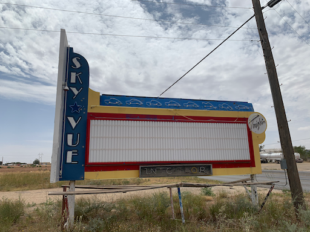

Solo the "[og](http://chibicode.github.io/solo)" version was previously developed, maintained and ultimately deprecated by [Shu Uesugi](https://github.com/chibicode).

> [Solo](http://chibicode.github.io/solo) is a Jekyll theme that supports **single-page websites** only, but supports them well. Yes, it's responsive. - _[Shu Uesugi](https://github.com/chibicode)_

The Solo must go on, so I'm gonna continue curating it as time allows.

__Goals for continuing Solo:__

* __Keep living the Solo dream__: Support one and only one page.
* __Keep it simple__: No dependencies other than [jekyll](https://jekyllrb.com/).
* __Make it customizable__: Bring your own colors and fonts.

The one and only one "implementation" page is the one you're looking at.

---

## Usage

* You need [jekyll](https://jekyllrb.com/).

```bash
git clone https://github.com/corbtastik/solo.git
cd solo
jekyll build
jekyll serve
```

---

## Style

The colors, typography and site logo can be styled to your tastes.

* Copy one of the examples in `_sass/solo/themes` to a new scss file.
* Provide color values for each variable.
* Enable by setting `style` in `_config.yml`.



---

## Cornucopia of Content

* [Headers](#headers)
* [Paragraph Text](#paragraph-text)
* [Blockquotes](#blockquotes)
* [Inline Text](#inline-text)
* [Code](#code)
* [Lists](#lists)
* [Tables](#tables)
* [Markdown Images](#markdown-images)
* [Thumbnail Images](#thumbnail-images)
* [Figure Images](#thumbnail-figure-images)
* [Image Flexbox](#image-flexbox)
* [Videos](#videos)

---

## Headers

H1 is reserved for the site header and not shown here.

## H2 Heading

### H3 Heading

#### H4 Heading

##### H5 Heading

###### H6 Heading

[↑↑↑](#){: .back-to-top}

---

## Paragraph text

[Baseball](https://en.wikipedia.org/wiki/Baseball) is a bat-and-ball sport played between two teams of nine players each, taking turns batting and fielding. The game is in play when a player on the fielding team, called the pitcher, throws a ball that a player on the batting team tries to hit with a bat. The objective of the offensive team (batting team) is to hit the ball into the field of play, away from the other team's players, allowing its players to run the bases, having them advance counter-clockwise around four bases to score what are called "runs". The objective of the defensive team (referred to as the fielding team) is to prevent batters from becoming runners, and to prevent runners' advance around the bases. A run is scored when a runner legally advances around the bases in order and touches home plate (the place where the player started as a batter). - copied from [Wikipedia](https://en.wikipedia.org/wiki/Baseball).

[↑↑↑](#){: .back-to-top}

---

## Blockquotes

### Single Blockquote

> In the United States and Canada, professional Major League Baseball (MLB) teams are divided into the National League (NL) and American League (AL), each with three divisions: East, West, and Central. The MLB champion is determined by playoffs that culminate in the World Series.

### Two paragraph Blockquote

> A baseball game is played between two teams,
> each usually composed of nine players, that take turns playing offense (batting and baserunning)
> and defense (pitching and fielding). A pair of turns,
> one at bat and one in the field, by each team constitutes an inning.
> 
> The game is played on a field whose primary boundaries, the foul lines,
> extend forward from home plate at 45-degree angles.
> The 90-degree area within the foul lines is referred to as fair territory;
> the 270-degree area outside them is foul territory.

### Nested Blockquote

> The number of players on a baseball roster, or squad, varies by league and by the level of organized play. A Major League Baseball (MLB) team has a roster of 25 players with specific roles. A typical roster features the following players:
>
> > Eight position players: the catcher, four infielders, and three outfielders—all of whom play on a regular basis.
>
> Most baseball leagues worldwide have the DH rule.

[↑↑↑](#){: .back-to-top}

---

## Blockquote w/ markdown

> ### Statistics
>
> 1. __At Bats:__ Plate appearances, excluding walks and hit by pitches.
> 2. __Hits:__ Times a base is reached safely, because of a batted ball.
> 3. __Runs:__ Times circling the bases and reaching home safely.
> 4. __RBIs:__ Number of runners who scored due to a batter's action.
> 5. __Home Runs:__ Hits on which the batter successfully touched all four bases.
> 6. __Batting Average:__ Hits divided by at bats.

[↑↑↑](#){: .back-to-top}

---

## Inline Text

- **Bold text**
- *Italicize text*
- <abbr title="Abbreviation">Abbr (abbreviation)</abbr>
- <cite>Citation</cite>
- <del>Deleted</del>
- <ins>Underlined</ins>
- Superscript <sup>text</sup>
- Subscript <sub>text</sub>
- Inline code `SELECT * FROM players;`

[↑↑↑](#){: .back-to-top}

---

## Code

> __Tip:__ Click the snippet header to copy to clipboard.


```java
package io.todos;

import org.springframework.boot.SpringApplication;
import org.springframework.boot.autoconfigure.SpringBootApplication;

@SpringBootApplication
public class WebUI {
    public static void main(String[] args) {
      SpringApplication.run(WebUI.class, args);
    }
}
```


```javascript
db.orders.find(
   { price: { $gt: 5000, $lte: 10000 }, cust_id: "mickey@mouse.com" }
)
```


```sql
SELECT *
FROM orders
WHERE cust_id = "mickey@mouse.com"
AND   price > 5000
AND   price <= 10000
```

[↑↑↑](#){: .back-to-top}

---

## Lists

### Unordered

* Arlington Stadium
* Rangers Ballpark in Arlington
* Ebbets Field
* Shea Stadium

* Boston Red Stockings
    * Boston Red Caps
        * Boston Beaneaters
            * Boston Red Sox

### Ordered

1. Babe Ruth
2. Willie Mays
3. Dale Murphy
4. Mookie Wilson

[↑↑↑](#){: .back-to-top}

---

## Tables

### Basic

> __See:__ [Github markdown tables](https://docs.github.com/en/get-started/writing-on-github/working-with-advanced-formatting/organizing-information-with-tables)

| Player        | BA            | HR           |
| ------------- | ------------- | ------------ |
| <a href="https://www.baseball-reference.com/players/a/aaronha01.shtml" target="_blank">Hank Aaron</a> | .305 | 755 |
| <a href="https://www.baseball-reference.com/players/r/ruthba01.shtml" target="_blank">Babe Ruth</a> | .342 | 714 |
| <a href="https://www.baseball-reference.com/players/w/wilsomo01.shtml" target="_blank">Mookie Wilson</a> | .274 | 67 |

### With formatted content

| Command | Description |
| --- | --- |
| `git rm` | <del>Remove</del> a file from the index |
| `git status` | List all *new or modified* files |
| `git diff` | Show file differences that **haven't been** staged |

### With cell alignment

| Left-aligned | Center-aligned | Right-aligned |
| :---         |     :---:      |          ---: |
| `git status` | `git status`   | `git status`  |
| `git diff`   | `git diff`     | `git diff`    |

[↑↑↑](#){: .back-to-top}

---

## Markdown Images

> The samples below demonstrate using [kramdown](https://github.com/gettalong/kramdown) to render images, kramdown is the default markdown converter for Jekyll.


[↑↑↑](#){: .back-to-top}

---

## CSS Images

### Square Images 

__16x16__



__24x24__


__32x32__


__48x48__


__64x64__


__96x96__


__128x128__


__192x192__


__256x256__


__384x384__


__448x448__


__512x512__


__640x640__


---

### 4-by-3 Ratio Images

__100-by-75__


__120-by-90__


__128-by-96__


__160-by-120__


__200-by-150__


__240-by-180__


__256-by-192__


__320-by-240__


__400-by-300__


__480-by-360__


__512-by-384__


__640-by-480__


---

### 3-by-4 Ratio Images

__75-by-100__


__90-by-120__


__96-by-128__


__120-by-160__


__150-by-200__


__180-by-240__


__192-by-256__


__240-by-320__


__300-by-400__


__360-by-480__


__384-by-512__


__480-by-640__


### 16-by-9 Ratio Images

__112-by-63__


__128-by-72__


__144-by-81__


__160-by-90__


__192-by-108__


__224-by-126__


__256-by-144__


__320-by-180__


__400-by-225__


__512-by-288__


__640-by-360__


### 9-by-16 Ratio Images

__63-by-112__


__72-by-128__


__81-by-144__


__90-by-160__


__108-by-192__


__126-by-224__


__144-by-256__


__180-by-320__


__225-by-400__


__270-by-480__


__288-by-512__


__360-by-640__


## Thumbnail Images





[↑↑↑](#){: .back-to-top}

---

## Circle Images

[↑↑↑](#){: .back-to-top}

---

## Image Flexbox

* Group images in a flexbox with 4 columns, add in multiples of 4.
* Add image data into `_data/images.yml`.
* Include `image/flexbox.html` on your page.
* Click to pop.



[↑↑↑](#){: .back-to-top}

---

## Videos



[↑↑↑](#){: .back-to-top}

---

## License

```text
MIT License (MIT)

Copyright (c) 2022 Corbs

Permission is hereby granted, free of charge, to any person obtaining a copy
of this software and associated documentation files (the "Software"), to deal
in the Software without restriction, including without limitation the rights
to use, copy, modify, merge, publish, distribute, sublicense, and/or sell
copies of the Software, and to permit persons to whom the Software is
furnished to do so, subject to the following conditions:

The above copyright notice and this permission notice shall be included in all
copies or substantial portions of the Software.

THE SOFTWARE IS PROVIDED "AS IS", WITHOUT WARRANTY OF ANY KIND, EXPRESS OR
IMPLIED, INCLUDING BUT NOT LIMITED TO THE WARRANTIES OF MERCHANTABILITY,
FITNESS FOR A PARTICULAR PURPOSE AND NONINFRINGEMENT. IN NO EVENT SHALL THE
AUTHORS OR COPYRIGHT HOLDERS BE LIABLE FOR ANY CLAIM, DAMAGES OR OTHER
LIABILITY, WHETHER IN AN ACTION OF CONTRACT, TORT OR OTHERWISE, ARISING FROM,
OUT OF OR IN CONNECTION WITH THE SOFTWARE OR THE USE OR OTHER DEALINGS IN THE
SOFTWARE.
```

[↑↑↑](#){: .back-to-top}
