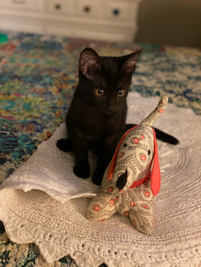
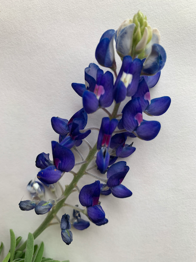

Yolo is a single page theme cut from the cloth of "[Solo](http://chibicode.github.io/solo)" which was previously developed and ultimately deprecated by [Shu Uesugi](https://github.com/chibicode).

##### Goals for Yolo

###### 1. Keep living the Solo dream

Support one-and-only-one page but treat it like a pet.

###### 2. Keep it simple

No dependencies other than [jekyll](https://jekyllrb.com/).

###### 3. Make it customizable

Bring your own [colors](#colors) and [fonts](#typography).

> The one-and-only-one "implementation" page is the one you're looking at.

---

## Usage

You need [jekyll](https://jekyllrb.com/).


```bash
git clone https://github.com/corbtastik/yolo.git
cd yolo
jekyll build
jekyll serve
```

---

## Themes

Yolo doesn't implement an "according to hoyle" Jekyll theme, but the colors, typography and site logo can be styled to your tastes.

> "Theming" for Yolo is accomplished by providing a custom theme scss file as outlined below.

* Copy one of the themes in `_sass/yolo/themes` to a new scss file.
* Provide color values for each variable.
* Enable by setting `site.style` in `_config.yml`.

---

## Yolo Elements

* [Colors](#colors)
* [Typography](#typography)
* [Flexbox](#flexbox)
* [Headers](#headers)
* [Paragraph Text](#paragraph-text)
* [Blockquotes](#blockquotes)
* [Inline Text](#inline-text)
* [Code](#code)
* [Lists](#lists)
* [Tables](#tables)
* [Markdown Images](#markdown-images)
* [Thumbnail Images](#thumbnail-images)
* [Square Images](#square-images)
* [Circle Images](#circle-images)
* [4-by-3 Aspect Images](#4-by-3-aspect-images)
* [3-by-4 Aspect Images](#3-by-4-aspect-images)
* [16-by-9 Aspect Images](#16-by-9-aspect-images)
* [9-by-16 Aspect Images](#9-by-16-aspect-images)
* [Image Lightbox](#image-lightbox)
* [Videos](#videos)

---

## Colors

Yolo's colors can be customized by adding a new theme SCSS file and setting the `site.style` value in `_config.yml`.



[↑↑↑](#){: .back-to-top}

---

## Typography

Yolo's typography implementation is based on [Bulma's Typography](https://bulma.io/documentation/helpers/typography-helpers/).



[↑↑↑](#){: .back-to-top}

---

## Flexbox

Yolo's flexbox implementation is based on [Bulma's "columns" interface](https://bulma.io/documentation/columns/).










[↑↑↑](#){: .back-to-top}

---

## Headers

H1 is reserved for the site header and not shown here.

## H2 Heading

### H3 Heading

#### H4 Heading

##### H5 Heading

###### H6 Heading

[↑↑↑](#){: .back-to-top}

---

## Paragraph text

[Baseball](https://en.wikipedia.org/wiki/Baseball) is a bat-and-ball sport played between two teams of nine players each, taking turns batting and fielding. The game is in play when a player on the fielding team, called the pitcher, throws a ball that a player on the batting team tries to hit with a bat. The objective of the offensive team (batting team) is to hit the ball into the field of play, away from the other team's players, allowing its players to run the bases, having them advance counter-clockwise around four bases to score what are called "runs". The objective of the defensive team (referred to as the fielding team) is to prevent batters from becoming runners, and to prevent runners' advance around the bases. A run is scored when a runner legally advances around the bases in order and touches home plate (the place where the player started as a batter). - copied from [Wikipedia](https://en.wikipedia.org/wiki/Baseball).

[↑↑↑](#){: .back-to-top}

---

## Blockquotes

### Single Blockquote

> In the United States and Canada, professional Major League Baseball (MLB) teams are divided into the National League (NL) and American League (AL), each with three divisions: East, West, and Central. The MLB champion is determined by playoffs that culminate in the World Series.

### Two paragraph Blockquote

> A baseball game is played between two teams,
> each usually composed of nine players, that take turns playing offense (batting and baserunning)
> and defense (pitching and fielding). A pair of turns,
> one at bat and one in the field, by each team constitutes an inning.
>
> The game is played on a field whose primary boundaries, the foul lines,
> extend forward from home plate at 45-degree angles.
> The 90-degree area within the foul lines is referred to as fair territory;
> the 270-degree area outside them is foul territory.

### Nested Blockquote

> The number of players on a baseball roster, or squad, varies by league and by the level of organized play. A Major League Baseball (MLB) team has a roster of 25 players with specific roles. A typical roster features the following players:
>
> > Eight position players: the catcher, four infielders, and three outfielders—all of whom play on a regular basis.
>
> Most baseball leagues worldwide have the DH rule.

[↑↑↑](#){: .back-to-top}

---

## Blockquote w/ markdown

> ### Statistics
>
> 1. __At Bats:__ Plate appearances, excluding walks and hit by pitches.
> 2. __Hits:__ Times a base is reached safely, because of a batted ball.
> 3. __Runs:__ Times circling the bases and reaching home safely.
> 4. __RBIs:__ Number of runners who scored due to a batter's action.
> 5. __Home Runs:__ Hits on which the batter successfully touched all four bases.
> 6. __Batting Average:__ Hits divided by at bats.

[↑↑↑](#){: .back-to-top}

---

## Inline Text

- Just plain text
- **Bold text**
- *Italicize text*
- <abbr title="Abbreviation">Abbr (abbreviation)</abbr>
- <cite>Citation</cite>
- <del>Deleted</del>
- <ins>Underlined</ins>
- Superscript <sup>text</sup>
- Subscript <sub>text</sub>
- Inline code `SELECT * FROM players;`

[↑↑↑](#){: .back-to-top}

---

## Code

> __Tip:__ Click the snippet header to copy to clipboard.


```bash
#!/bin/bash
while true; do
    read -p "Do you wish to continue (yes or no)? " yn
    case $yn in
        [Yy]* ) break;;
        [Nn]* ) exit;;
        * ) echo "Please answer yes or no.";;
    esac
done
```


```java
package io.todos;

import org.springframework.boot.SpringApplication;
import org.springframework.boot.autoconfigure.SpringBootApplication;

@SpringBootApplication
public class WebUI {
    public static void main(String[] args) {
      SpringApplication.run(WebUI.class, args);
    }
}
```


```javascript
db.orders.find(
   { price: { $gt: 5000, $lte: 10000 }, cust_id: "mickey@mouse.com" }
)
```


```sql
SELECT *
FROM orders
WHERE cust_id = "mickey@mouse.com"
AND   price > 5000
AND   price <= 10000
```

[↑↑↑](#){: .back-to-top}

---

## Lists

### Unordered

* Arlington Stadium
* Rangers Ballpark in Arlington
* Ebbets Field
* Shea Stadium

* Boston Red Stockings
    * Boston Red Caps
        * Boston Beaneaters
            * Boston Red Sox

### Ordered

1. Babe Ruth
2. Willie Mays
3. Dale Murphy
4. Mookie Wilson

[↑↑↑](#){: .back-to-top}

---

## Tables

### Basic

> __See:__ [Github markdown tables](https://docs.github.com/en/get-started/writing-on-github/working-with-advanced-formatting/organizing-information-with-tables)

| Player        | BA            | HR           |
| ------------- | ------------- | ------------ |
| <a href="https://www.baseball-reference.com/players/a/aaronha01.shtml" target="_blank">Hank Aaron</a> | .305 | 755 |
| <a href="https://www.baseball-reference.com/players/r/ruthba01.shtml" target="_blank">Babe Ruth</a> | .342 | 714 |
| <a href="https://www.baseball-reference.com/players/w/wilsomo01.shtml" target="_blank">Mookie Wilson</a> | .274 | 67 |

### With formatted content

| Command | Description |
| --- | --- |
| `git rm` | <del>Remove</del> a file from the index |
| `git status` | List all *new or modified* files |
| `git diff` | Show file differences that **haven't been** staged |

### With cell alignment

| Left-aligned | Center-aligned | Right-aligned |
| :---         |     :---:      |          ---: |
| `git status` | `git status`   | `git status`  |
| `git diff`   | `git diff`     | `git diff`    |

[↑↑↑](#){: .back-to-top}

---

## Markdown Images

[Kramdown](https://github.com/gettalong/kramdown) is the default markdown converter for [Jekyll](https://jekyllrb.com/) and supports adding images via markdown.

> Images added via markdown receive styling from the `` element, they're not styled with `yolo` scss.  


```markdown


```


[↑↑↑](#){: .back-to-top}

---

## Thumbnail Images

Thumbnails are 128px x 128px and use the `thumbnail` class.


```html

```

> Click to enlarge.



[↑↑↑](#){: .back-to-top}

---

## Square Images

Square images can be added with the following classes: `is-16`, `is-24`, `is-32`, `is-48`, `is-64`, `is-96`, `is-128`,
`is-192`, `is-256`, `is-384`, `is-448`, `is-512`, `is-640`.


```html

```

> Click to enlarge.


[↑↑↑](#){: .back-to-top}

---

## Circle Images

Circle images can be added with the following classes: `is-circle-16`, `is-circle-24`, `is-circle-32`,
`is-circle-48`, `is-circle-64`, `is-circle-96`, `is-circle-128`, `is-circle-192`, `is-circle-256`, `is-circle-384`,
`is-circle-448`, `is-circle-512`, `is-circle-640`.


```html

```

> Click to enlarge.



[↑↑↑](#){: .back-to-top}

---

## 4-by-3 Aspect Images

4 by 3 aspect ratio images can be added with the following classes: `is-100-by-75`, `is-120-by-90`, `is-128-by-96`,
`is-160-by-120`, `is-200-by-150`, `is-240-by-180`, `is-256-by-192`, `is-320-by-240`, `is-400-by-300`,
`is-480-by-360`, `is-512-by-384`, `is-640-by-480`.


```html

```

> Click to enlarge.


[↑↑↑](#){: .back-to-top}

---

## 3-by-4 Aspect Images

3 by 4 aspect ratio images can be added with the following classes: `is-75-by-100`, `is-90-by-120`, `is-96-by-128`,
`is-120-by-160`, `is-150-by-200`, `is-180-by-240`, `is-192-by-256`, `is-240-by-320`, `is-300-by-400`,
`is-360-by-480`, `is-384-by-512`, `is-480-by-640`.


```html

```

> Click to enlarge.


[↑↑↑](#){: .back-to-top}

---

## 16-by-9 Aspect Images

16 by 9 aspect ratio images can be added with the following classes: `is-112-by-63`, `is-128-by-72`, `is-144-by-81`,
`is-160-by-90`, `is-192-by-108`, `is-224-by-126`, `is-256-by-144`, `is-320-by-180`, `is-400-by-225`, `is-480-by-270`,
`is-512-by-288`, `is-640-by-360`.


```html

```

> Click to enlarge.


[↑↑↑](#){: .back-to-top}

---

## 9-by-16 Aspect Images

9 by 16 aspect ratio images can be added with the following classes: `is-63-by-112`, `is-72-by-128`, `is-81-by-144`,
`is-90-by-160`, `is-108-by-192`, `is-126-by-224`, `is-144-by-256`, `is-180-by-320`, `is-225-by-400`, `is-270-by-480`,
`is-288-by-512`, `is-360-by-640`.


```html

```

> Click to enlarge.


[↑↑↑](#){: .back-to-top}

---

## Image Lightbox

Yolo includes a lightbox element based on [Bulma's flexbox implementation](https://bulma.io/documentation/columns/).

* 4 column flexbox with square images.
* Add image data into `_data/images.yml`.
* Include `image/lightbox.html` on your page.
* Click image to enlarge.
  * Click on right side of an enlarged image to move forward.
  * Click on left side of an enlarged image to move back.
  * Arrow left `<` and Arrow right `>` keys work too.



[↑↑↑](#){: .back-to-top}

---

## Videos



[↑↑↑](#){: .back-to-top}

---

## License

```text
MIT License (MIT)

Copyright (c) 2022 Corbs

Permission is hereby granted, free of charge, to any person obtaining a copy
of this software and associated documentation files (the "Software"), to deal
in the Software without restriction, including without limitation the rights
to use, copy, modify, merge, publish, distribute, sublicense, and/or sell
copies of the Software, and to permit persons to whom the Software is
furnished to do so, subject to the following conditions:

The above copyright notice and this permission notice shall be included in all
copies or substantial portions of the Software.

THE SOFTWARE IS PROVIDED "AS IS", WITHOUT WARRANTY OF ANY KIND, EXPRESS OR
IMPLIED, INCLUDING BUT NOT LIMITED TO THE WARRANTIES OF MERCHANTABILITY,
FITNESS FOR A PARTICULAR PURPOSE AND NONINFRINGEMENT. IN NO EVENT SHALL THE
AUTHORS OR COPYRIGHT HOLDERS BE LIABLE FOR ANY CLAIM, DAMAGES OR OTHER
LIABILITY, WHETHER IN AN ACTION OF CONTRACT, TORT OR OTHERWISE, ARISING FROM,
OUT OF OR IN CONNECTION WITH THE SOFTWARE OR THE USE OR OTHER DEALINGS IN THE
SOFTWARE.
```

[↑↑↑](#){: .back-to-top}
